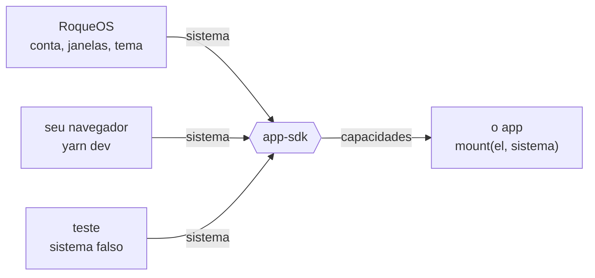

<p align="center">
  <a href="https://roqueos.com.br"></a>
</p>

Os apps do [RoqueOS](https://roqueos.com.br), o sistema operacional que roda inteiro no
navegador. Cada app que nasceu dentro do RoqueOS sai para o próprio repositório, fala com o
sistema só pelo [`app-sdk`](https://github.com/roqueos-apps/app-sdk) e tem o código aberto sob
MIT. Todos rodam de graça em [roqueos.com.br](https://roqueos.com.br), no computador, no
celular e na TV.

_English below._

## Os apps

|                                                                                                                                      | App                                                             | O que é                                                             |                                    |
| :----------------------------------------------------------------------------------------------------------------------------------: | --------------------------------------------------------------- | ------------------------------------------------------------------- | :--------------------------------: |
|  | [**Calculadora**](https://github.com/roqueos-apps/calculadora)  | Calculadora científica.                                             | [Usar](https://roqueos.com.br/app) |
|        | [**Notas Autoadesivas**](https://github.com/roqueos-apps/notas) | Notas autoadesivas para sua área de trabalho.                       | [Usar](https://roqueos.com.br/app) |
|       | [**QR Code**](https://github.com/roqueos-apps/qrcode)           | Gere QR Codes de links, Wi-Fi, e-mail e texto, no próprio aparelho. | [Usar](https://roqueos.com.br/app) |
|        | [**Quadro Branco**](https://github.com/roqueos-apps/lousa)      | Quadro branco para anotações e desenhos.                            | [Usar](https://roqueos.com.br/app) |
|       | [**Câmera**](https://github.com/roqueos-apps/camera)            | Tire fotos e grave vídeos.                                          | [Usar](https://roqueos.com.br/app) |

### Para quem constrói um app

| Repo                                                 | O que é                                                                                                                                                       |
| ---------------------------------------------------- | ------------------------------------------------------------------------------------------------------------------------------------------------------------- |
| [`app-sdk`](https://github.com/roqueos-apps/app-sdk) | O contrato entre o RoqueOS e um app: definirApp, as capacidades do sistema, o manifesto app.json, sistemas de desenvolvimento e de teste, e o app check. MIT. |
| [`ui`](https://github.com/roqueos-apps/ui)           | O kit de interface dos apps do RoqueOS: ícones, interruptor, folha, confirmação e estado vazio, sem Quasar, com as variáveis do tema como contrato. MIT.      |

## Como um app fala com o RoqueOS

Nenhum app importa nada de dentro do sistema. Cada um exporta `mount(el, sistema)` e usa só as
capacidades que o sistema entrega: quem está usando, avisos, idioma, perfil do aparelho,
métricas e onde guardar as coisas dele. O contrato é o
[`app-sdk`](https://github.com/roqueos-apps/app-sdk), e por isso o mesmo app roda dentro do
RoqueOS, sozinho no seu navegador e no teste, sem saber em qual dos três está.



## Rodar um app na sua máquina

Precisa de Node 22 ou mais novo e do Yarn 1.22.

```sh
git clone https://github.com/roqueos-apps/app-sdk.git
cd app-sdk
yarn install --ignore-scripts
yarn verificar
```

Num repo de app, `yarn dev` abre o app numa janela falsa do RoqueOS, com o seletor dos dez
idiomas, e `yarn verificar` roda lint, formato, testes e o `app check`, o mesmo que o CI roda
no pull request.

## Participar

- Achou um bug ou tem uma ideia para um app? Abra uma issue no repo dele.
- Pergunta, sugestão ou vontade de mostrar o que construiu: use as
  [Discussions](https://github.com/orgs/roqueos-apps/discussions).
- Quer mandar código? Todo commit leva `Signed-off-by` (DCO, `git commit -s`). Cada repo tem o
  próprio `CONTRIBUTING.md`; a régua comum está em
  [CONTRIBUTING.md](https://github.com/roqueos-apps/.github/blob/main/CONTRIBUTING.md) e o
  combinado de convivência em
  [CODE_OF_CONDUCT.md](https://github.com/roqueos-apps/.github/blob/main/CODE_OF_CONDUCT.md).
- Falha de segurança não vai em issue pública: veja
  [SECURITY.md](https://github.com/roqueos-apps/.github/blob/main/SECURITY.md).

## Licença

Código e arte própria sob MIT. Asset de terceiro segue a licença registrada no `ASSETS.md` de
cada repo. O RoqueOS em si é fechado; só os apps que ele criou abrem aqui. Os jogos têm a casa
deles, a [roqueos-games](https://github.com/roqueos-games).

---

## English

The apps of [RoqueOS](https://roqueos.com.br), an operating system that runs entirely in the
browser. Every app born inside RoqueOS moves to its own repository, talks to the system only
through the [`app-sdk`](https://github.com/roqueos-apps/app-sdk) and is open source under
MIT. All of them run for free at [roqueos.com.br](https://roqueos.com.br), on desktop, phone
and TV.

<details>
<summary>The apps</summary>

|                                                                                                                                      | App                                                           | What it is                                                            |                                   |
| :----------------------------------------------------------------------------------------------------------------------------------: | ------------------------------------------------------------- | --------------------------------------------------------------------- | :-------------------------------: |
|  | [**Calculator**](https://github.com/roqueos-apps/calculadora) | Scientific Calculator.                                                | [Use](https://roqueos.com.br/app) |
|        | [**Sticky Notes**](https://github.com/roqueos-apps/notas)     | Sticky notes for your desktop.                                        | [Use](https://roqueos.com.br/app) |
|       | [**QR Code**](https://github.com/roqueos-apps/qrcode)         | Make QR codes for links, Wi-Fi, email and text, right on your device. | [Use](https://roqueos.com.br/app) |
|        | [**Whiteboard**](https://github.com/roqueos-apps/lousa)       | Whiteboard for notes and drawings.                                    | [Use](https://roqueos.com.br/app) |
|       | [**Camera**](https://github.com/roqueos-apps/camera)          | Take photos and record videos.                                        | [Use](https://roqueos.com.br/app) |

</details>

Libraries for building an app: [`app-sdk`](https://github.com/roqueos-apps/app-sdk), [`ui`](https://github.com/roqueos-apps/ui).

An app exports `mount(el, system)` and uses only the capabilities the system hands it (who is
using it, notices, language, device profile, metrics and its own storage). That contract is
the `app-sdk`, so the same app runs inside RoqueOS, standalone in your browser and in tests.
To run one locally: Node 22+, Yarn 1.22, then `yarn install --ignore-scripts` and `yarn dev`;
`yarn verificar` runs the same checks as CI.

Issues and pull requests in English are welcome; code and comments are in Brazilian
Portuguese, and every commit must be signed off (DCO). Questions and ideas go to
[Discussions](https://github.com/orgs/roqueos-apps/discussions); vulnerabilities go through
[SECURITY.md](https://github.com/roqueos-apps/.github/blob/main/SECURITY.md), never a public
issue. Code and original art are MIT; third-party assets follow the license listed in each
repo's `ASSETS.md`. RoqueOS itself is closed source; its games live in
[roqueos-games](https://github.com/roqueos-games).
